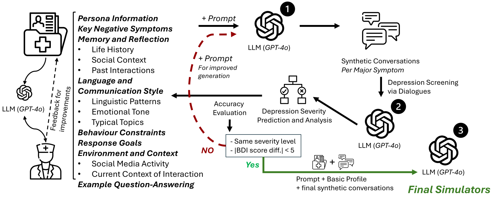

# 🧑‍⚕️💬 _TalkDep_: Clinically Grounded LLM Personas for Conversation-Centric Depression Screening

<!-- Author list (center-aligned) -->
<div style="text-align:center; line-height:1.4; font-family:system-ui, sans-serif;">

  <!-- Authors with numbered affiliations -->
  <strong>Xi Wang</strong><sup>2</sup>, <a href="mailto:anxo.pvila@udc.es"><strong>Anxo Pérez</strong></a><sup>1</sup>, <strong>Javier Parapar</strong><sup>1</sup>, <strong>Fabio Crestani</strong><sup>3</sup>


  <!-- Affiliation list -->
  <sup>1</sup> IRLab, CITIC, Universidade da Coruña, A Coruña, Spain<br>
  <sup>2</sup> School of Computer Science, University of Sheffield, Sheffield, UK<br>
  <sup>3</sup> Faculty of Informatics, Università della Svizzera italiana (USI), Lugano, Switzerland

</div>





## 📌  Overview

This repository accompanies the paper **“_TalkDep_: Clinically Grounded LLM Personas for Conversation-Centric Depression Screening”** and contains all code, data, and instructions needed to replicate its experiments. 


 ## Abstract
The increasing demand for mental health services has outpaced the availability of trained clinical professionals, leading to limited support for depression diagnosis. This shortage has motivated the development of simulated or virtual patients to assist in training and evaluation, but existing approaches often fail to generate clinically valid, natural and diverse symptom presentations. In this work, we embrace the recent advanced language models as the backbone and propose a novel clinician-in-the-loop patient simulation pipeline, _**TalkDep**_, with access to diversified patient profiles to develop simulated patients. By conditioning the model on psychiatric diagnostic criteria, symptom severity scales, and contextual factors, we aim to create authentic patient responses that can better support diagnostic model training and evaluation. We verify the reliability of these simulated patients with thorough assessments conducted by clinical professionals. The availability of validated simulated patients offers a scalable and adaptable resource for improving the robustness and generalisability of automatic depression diagnosis systems.

## 📁 Repository Structure

```text
.
├──  persona-development/       # resources related to the development of simulated personas   
│    └── llm-personas-information/       # Conversation logs, prompts, golden‑truth ranking
|       └── patient_profiles/       # profiles prepared by clinical professionals
│       └── golden_truth_BDI_depression_ranking.txt   # Golden truth depression ranking the LLM personas based on the BDI-II
|    └── conversation_generation/        # release prompts for the generation of synthetic dialogues as additional context
|       └── llms-personas-initial-prompts        # The prompts used to generate the initial conversations
|       └── depression_screening        # assess the generated dialogues as depression screening via LLMs
|       └── re-generation_prompt         # prompt for improving generated dialogues if regeneration is required
│       └── final_conversations/   # final conversations as enriched context

├── evaluation/
|   └── expert_evaluation/       # instructions for clinician evaluation
|       └── evaluation_instruction.md       # instruction for the evaluation scheme  
│       └── Form-Simulation_Evaluation_of_LLM_Personas.pdf   # Form with the evaluation of LLM personas given to clinicians
│   └── llms-as-judges/
│       └── structured_output/
│           └── llm_judge_compare_depression.py  # Main experiment script
│           └── evaluation/evaluate_ranking_depression_prediction.py  # Evaluation script
│           └── singularity/  # Bash scripts designed to facilitate the use of Singularity containers for the experiments
│           └── results/  # Results from the four LLMs included in the paper


└── README.md                       # You are here 🙂

```

## 🔬  Quick Start for _LLMs as Judges_

### 🔧 Running the Experiments
*Important, you need to infrastructure to deploy your Ollama server and models. We use singularity in this repository for constructing the images and running the experiments, but you can use Docker or any technology you may prefer.*

1.  **Prepare the data**
    
    Place the patient conversation `.txt` files in a directory, e.g.:
    
    ```text
    data/conversations/
    ├── patient_01.txt
    ├── patient_02.txt
    └── ...
    
    ```
    
2.  **Launch the comparison script**
    
    ```bash
    python evaluation/llms-as-judges/structured_output/llm_judge_compare_depression.py \
        /path/to/conversations \
        /path/to/results.jsonl
    
    ```
    
    -   `conversations_dir` – directory containing the `.txt` logs
        
    -   `results_file` – path where the JSONL results will be written
        

### 📊  Evaluating the Results

```bash
python  evaluation/llms-as-judges/evaluation/evaluate_ranking_depression_prediction.py \
    /path/to/results.jsonl \
    llm-personas-information/golden_truth_BDI_depression_ranking.txt

```

The script reports accuracy metrics by comparing your model’s ranking against the **BDI (Beck Depression Inventory) golden‑truth** in `golden_truth_BDI_depression_ranking.txt`.


## Personas


| Name  | Depression Severity Level | Link to access |
| ------------- | ------------- | ------------- |
| Noah | Minimal Depression | <a href="https://chatgpt.com/g/g-6779b5a32ae0819187a2a7d32390a137-simulator-noah">Noah</a>|
| Maya| Minimal Depression | <a href="https://chatgpt.com/g/g-6779b6e94d48819190bb9bf303515623-simulator-maya">Maya</a>|
| Priya| Minimal Depression | <a href="https://chatgpt.com/g/g-6779b973698c81918e29a89884dddb56-simulator-priya">Priya</a>|
| Alex| Mild Depression | <a href="https://chatgpt.com/g/g-6779bb03eea8819182eabb7823ccffbf-simulator-alex">Alex</a>|
| Gabriel| Mild Depression | <a href="https://chatgpt.com/g/g-6779bbf1d7c881918e103719c522a28e-simulator-gabriel">Gabriel</a>|
| Ethan| Mild Depression | <a href="https://chatgpt.com/g/g-6779bc87de408191977be5c0e0e18469-simulator-ethan">Ethan</a>|
| Linda| Moderate Depression | <a href="https://chatgpt.com/g/g-6779bd7a8a34819191f6d456b75c862c-simulator-linda">Linda</a>|
| James| Moderate Depression | <a href="https://chatgpt.com/g/g-6779be31e4e88191aa2c843eeebd120c-simulator-james">James</a>|
| Laura| Moderate Depression | <a href="https://chatgpt.com/g/g-6779bee8896081918d38b263dad5027f-simulator-laura">Laura</a>|
| Maria| Severe Depression | <a href="https://chatgpt.com/g/g-6779ad02aca88191a4782b2bc98d1815-simulator-maria">Maria</a>|
| Elena| Severe Depression | <a href="https://chatgpt.com/g/g-6779bffd57c48191bef95479db07cf0c-simulator-elena">Elena</a>|
| Marco| Severe Depression | <a href="https://chatgpt.com/g/g-6779c098e4748191af9ed2063b15f70f-simulator-marco">Marco</a>|


## 📝 Citation

*Coming soon – paper under submission.*  
If you use this resource, please ⭐ star the repo and stay tuned for citation info.

---

## 📬 Contact

For questions, please reach out via email: `anxo.pvila@udc.es`
